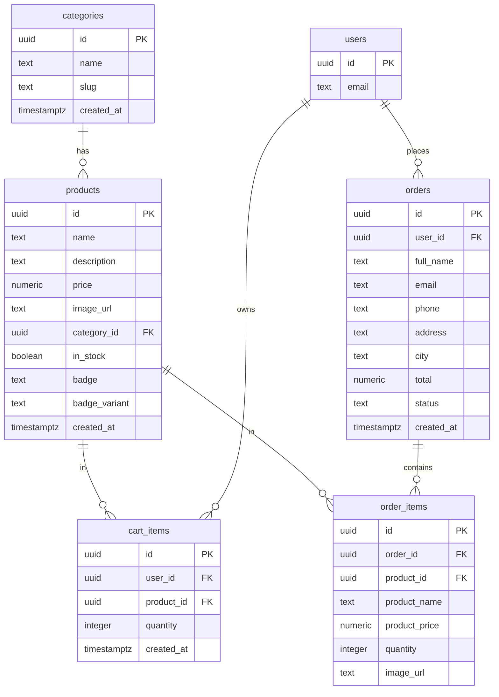

# NATI NBA SHOP

> Premium NBA fan gear — designed by Nati, ships worldwide.

**Live site:** [nati-nba-shop.vercel.app](https://nati-nba-shop.vercel.app)

---

## Overview

NATI NBA SHOP is a full-stack e-commerce store for premium NBA fan gear — clothing, hats, posters, scarves, and accessories — all curated and designed by Nati. Every piece is limited edition, built for fans who live and breathe the game.

---

## The Problem

NBA fans who want unique, non-generic merchandise are stuck choosing between mass-produced official NBA gear (expensive, impersonal) or low-quality knockoffs. There's no middle ground: a place where a real fan curates limited drops with an actual design vision behind them.

---

## Target Audience

NBA fans — primarily ages 16–35 — who care about how they rep their fandom. They want pieces that look good, feel premium, and aren't worn by everyone at the arena. They shop online, follow drops on social media, and buy when something feels exclusive.

---

## Competitors & Differentiation

| Competitor | What they offer | Our edge |
|---|---|---|
| NBA Store (nba.com/store) | Official licensed gear | Mass-produced, generic, expensive |
| Fanatics | Wide selection of fan gear | Same mass-market problem, no curation |
| Amazon / AliExpress | Cheap NBA-branded items | Low quality, no identity |
| Local print-on-demand shops | Custom jerseys/tees | No design vision, one-off items |

**What makes NATI NBA SHOP different:** Every item is personally selected and designed by one person with a real aesthetic. Drops are limited — when it's gone, it's gone. The brand has a voice, not just a catalog.

---

## Features

- Browse products by category (Clothing, Hats, Posters, Scarves, Accessories)
- Limited Edition drops with stock indicator
- Cart with free shipping progress bar ($75 threshold)
- Full checkout flow with order confirmation
- User authentication (sign up / sign in / password reset)
- Auto-logout after 15 minutes of inactivity
- Related products on each product page
- Policy pages: Shipping, Returns, Size Guide, Privacy
- Admin dashboard to manage products, categories, and orders
- Responsive — works on mobile and desktop

---

## Tech Stack

| Layer | Technology |
|---|---|
| Frontend | React 18 + Vite |
| Styling | Tailwind CSS |
| Routing | React Router v6 |
| Backend / DB | Supabase (PostgreSQL) |
| Auth | Supabase Auth (email + password) |
| Storage | Supabase Storage (product images) |
| Hosting | Vercel |

---

## External Services & Integrations

| Service | Type | Purpose |
|---|---|---|
| Supabase | Backend-as-a-Service | Database (PostgreSQL), user authentication, and image storage |
| Vercel | Hosting / Deployment | Auto-deploy on push to `main`; serves the production site |
| Google Material Symbols | CDN / Icon library | UI icons throughout the app (cart, search, navigation, etc.) |
| Google Fonts | CDN / Typography | Space Grotesk font used for headlines and branding |

---

## Database Schema (ERD)

The database is hosted on Supabase (PostgreSQL). The diagram below is rendered automatically by GitHub:



---

## Demo & Testing Guide

### Regular User Flow

1. Go to [nati-nba-shop.vercel.app](https://nati-nba-shop.vercel.app)
2. Click **Sign Up** and create a free account with any email and password
3. Browse products by category → click a product → add to cart
4. Go to Cart → proceed to Checkout
5. Fill in any delivery details and click **Place Order**
6. After placing an order, click **My Orders** in the top bar to see order history and status
7. Stay idle for 15 minutes → an auto-logout warning modal will appear with a 60-second countdown

No payment information is required — checkout saves the order directly to the database.

---

### Admin Panel

The admin panel allows managing products, categories, and orders.

| Field | Value |
|---|---|
| **URL** | [nati-nba-shop.vercel.app/admin](https://nati-nba-shop.vercel.app/admin) |
| **Email** | natinati1177@gmail.com |
| **Password** | Nati2107 |

**What the admin can do:**
- **Dashboard** — overview of total products, categories, and orders
- **Products** — add, edit, or delete products (name, price, image, category, stock, badge)
- **Categories** — manage product categories
- **Orders** — view all customer orders, update order status (Pending → Processing → Shipped → Delivered)

---

## Running Locally

```bash
git clone https://github.com/natinati1177-gif/chi-sweater-co.git
cd chi-sweater-co
npm install
```

Create a `.env` file at the project root:

```env
VITE_SUPABASE_URL=your_supabase_project_url
VITE_SUPABASE_ANON_KEY=your_supabase_anon_key
```

Then:

```bash
npm run dev
```

Open [http://localhost:5173](http://localhost:5173).

---

## Deployment

The project auto-deploys to Vercel on every push to the `main` branch. The `vercel.json` includes an SPA rewrite rule so React Router handles all routes client-side.
